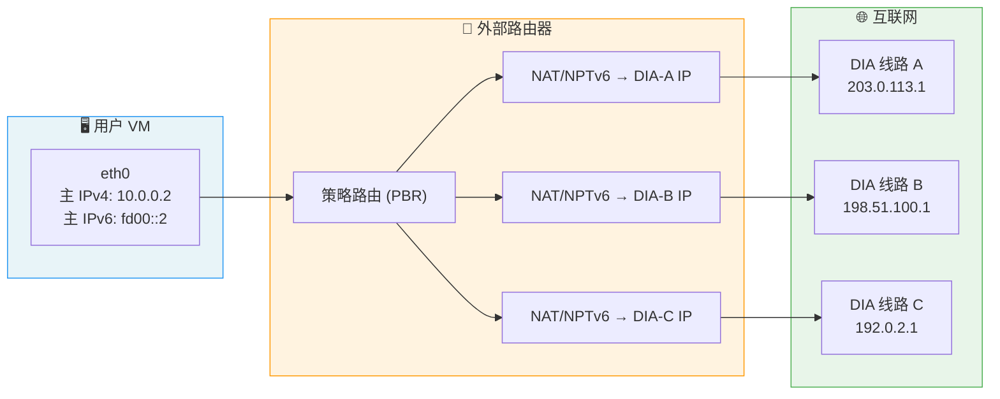
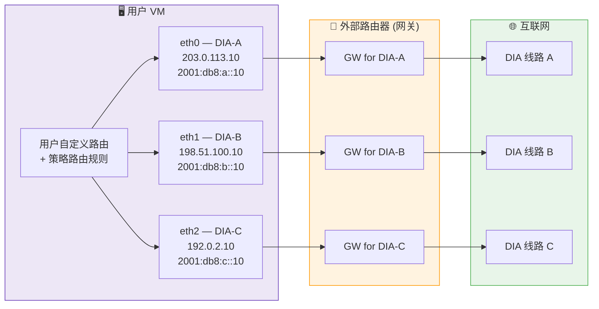

# 多 DIA 线路 VM 网络架构说明

> **生效日期**：2025-03-28 起，新开通 VM 默认采用 **多网卡（多 NIC）架构**。
> 此前开通的 VM 默认为 **托管路由（路由器 PBR）架构**。
> 如需从 PBR 架构迁移至多 NIC 架构，请提交工单申请；**暂不支持**从多 NIC 架构回退至 PBR 架构。

---

## 一、架构总览

| 对比项 | 托管路由（PBR）架构 | 多网卡（多 NIC）架构 |
|---|---|---|
| VM 内网卡数量 | **1 张** | **每条 DIA 线路 1 张** |
| IP 地址分配 | 主 IPv4 + 主 IPv6（内部地址） | 各 NIC 直接配置 DIA 线路 IP |
| 选路方式 | 外部路由器执行策略路由（PBR） | 用户在 VM 内自行配置路由 |
| NAT 行为（独立公网 IPv4） | 路由器 1:1 NAT | **不 NAT**，IP 直接可用 |
| NAT 行为（共享公网 IPv4） | 路由器 SNAT / DNAT | 路由器 SNAT / DNAT |
| IPv6 处理 | NPTv6 转换 | 直接配置，无需转换 |
| 出口 IP 感知 | 需通过公网探测获取 | NIC 上配置的即为出口 IP |
| 上手难度 | ⭐ 开箱即用 | ⭐⭐⭐ 需手动配置路由 |
| 灵活性 | 一般 | 高 |

---

## 二、架构图示

### 2.1 托管路由（PBR）架构



**数据流说明**：

1. VM 所有出站流量通过唯一的 `eth0` 发出
2. 外部路由器根据策略路由规则（目标 IP / 协议 / 端口等）决定走哪条 DIA
3. 路由器执行地址转换（独立公网 IPv4 → 1:1 NAT；共享公网 IPv4 → SNAT/DNAT；IPv6 → NPTv6）
4. 入站流量由路由器反向 NAT 后送入 VM

### 2.2 多网卡（多 NIC）架构



**数据流说明**：

1. 每条 DIA 线路对应 VM 内一张独立网卡，IP 直接配置在网卡上
2. 用户在 VM 内通过路由表、ip rule 等机制控制流量走哪张网卡
3. 外部路由器仅作为网关进行 IP 路由转发（独立公网 IPv4 不做 NAT）
4. 共享公网 IPv4 场景下，路由器仍执行 SNAT/DNAT

---

## 三、托管路由（PBR）架构使用指南

### 3.1 基本使用

此架构开箱即用，无需额外配置。VM 的所有流量会由外部路由器自动选路。

### 3.2 获取出口 IP

由于 NAT 的存在，VM 内部 IP 与实际出口 IP 不同。可通过以下方式探测：

```bash
# 获取当前出口 IPv4
curl -4 ifconfig.me

# 获取当前出口 IPv6
curl -6 ifconfig.me
```

> **注意**：不同目标地址可能走不同的 DIA 线路，导致出口 IP 不同。
> 如需确认特定目标走哪条线路，可针对性测试：

```bash
# 追踪到特定目标的路径
traceroute -n 8.8.8.8
traceroute -6 -n 2001:4860:4860::8888
```

### 3.3 注意事项

- 选路策略由平台路由器管理，用户无法自行修改
- 如需调整选路规则，请提交工单说明需求
- 不建议在 VM 内配置额外的 NAT 规则，可能与平台 NAT 冲突

---

## 四、多网卡（多 NIC）架构使用指南

> ⚠️ **SSH 连接注意事项**：VM 开通后，cloud-init 会为每张网卡自动下发 IP 与网关地址，导致系统同时存在多条默认路由。在完成策略路由配置之前，回程流量可能从错误的网卡出去，造成 **SSH 连接中断或无法建立**。
> **强烈建议通过 VNC 控制台登录 VM**，完成以下配置后再使用 SSH 访问。

### 4.1 查看网卡信息

开通后，登录 VM 查看已分配的网卡：

```bash
# 查看所有网卡及 IP 地址
ip -c addr show

# 查看当前路由表
ip route show
ip -6 route show
```

典型输出示例（3 条 DIA 线路）：

```
eth0: 203.0.113.10/24        # DIA-A
eth1: 198.51.100.10/24       # DIA-B
eth2: 192.0.2.10/24          # DIA-C
```

### 4.2 配置策略路由（关键步骤）

多网卡环境下，**必须配置源地址策略路由**，否则回程流量可能走错网卡导致连接异常。

**推荐方式：使用一键脚本（Debian / Ubuntu + Netplan）**

下载 [setup-pbr.py](mulit-nic-routing/setup-pbr.py) 到 VM 上执行：

```bash
# 安装依赖
sudo apt install python3-yaml

# 预览将生成的配置（不写入文件）
sudo python3 setup-pbr.py --dry-run

# 确认无误后正式执行
sudo python3 setup-pbr.py
```

脚本会自动读取 cloud-init 生成的 netplan 配置，生成带 metric 的主路由配置和 PBR 策略路由文件，并通过 `netplan try` 安全应用（120 秒内未确认将自动回滚）。

**手动配置**：参见 [多网卡 Netplan 配置指南](mulit-nic-routing/netplan.md)，文档涵盖逐步操作说明和完整的 YAML 示例。

### 4.3 自定义分流路由

多 NIC 架构的优势在于可灵活控制流量走向：

```bash
# 示例：指定目标走特定线路
# 访问 8.8.8.0/24 走 DIA-B
sudo ip route add 8.8.8.0/24 via 198.51.100.1 dev eth1

# 指定特定源 IP 出站
curl --interface 198.51.100.10 ip.sb
curl --interface eth1 ip.sb

# 使用 iptables MARK + ip rule 实现基于端口的分流
sudo iptables -t mangle -A OUTPUT -p tcp --dport 443 -j MARK --set-mark 0x65
sudo ip rule add fwmark 0x65 table dia_b priority 50
```

### 4.4 验证配置

```bash
# 验证各线路的出口 IP 是否正确
curl --interface eth0 -4 ip.sb   # 应返回 DIA-A 的公网 IP
curl --interface eth1 -4 ip.sb   # 应返回 DIA-B 的公网 IP
curl --interface eth2 -4 ip.sb   # 应返回 DIA-C 的公网 IP

# 查看策略路由规则
ip rule show
ip -6 rule show

# 查看各路由表内容
ip route show table dia_a
ip route show table dia_b
ip route show table dia_c
```

---

## 五、架构迁移

### 从 PBR 架构迁移至多 NIC 架构

1. **提交工单**：说明需要迁移至多 NIC 架构
2. **准备迁移**：迁移过程中会有网络中断，请提前安排维护窗口
3. **迁移后配置**：参照 [第四章](#四多网卡多-nic架构使用指南) 完成路由配置
4. **验证连通性**：使用 [4.4 节](#44-验证配置) 的方法验证各线路正常

> ⚠️ **注意**：迁移为单向操作，迁移至多 NIC 架构后**无法回退**至 PBR 架构。请在迁移前充分评估。

---

## 六、常见问题

**Q: 多 NIC 架构下，不配置策略路由会怎样？**
A: 回程流量可能从错误的网卡发出，导致源 IP 与入站时不一致，远端会丢弃该数据包（非对称路由问题），表现为部分连接超时或不可达。

**Q: PBR 架构下能否指定某个服务走特定 DIA？**
A: 不能在 VM 内直接控制。需提交工单，由平台在路由器上调整策略路由规则。

**Q: 多 NIC 架构下 DNS 应该怎么配？**
A: 建议将 DNS 解析器指向默认路由所在线路的网关或使用公共 DNS（如 `8.8.8.8`、`1.1.1.1`）。如果希望 DNS 查询走特定线路，可在 `/etc/resolv.conf` 或 `systemd-resolved` 中指定对应网卡。

**Q: 我的 VM 是 03/28 之前开通的，现在是哪种架构？**
A: 03/28 之前开通的 VM 默认为 PBR 架构。可通过 `ip addr` 查看网卡数量来确认——若只有一张公网网卡则为 PBR 架构，多张则为多 NIC 架构。