# 使用 ESA 加速部署在 SparkVM 的 Web 服务

SparkVM 部分系列机器提供仅在 IX 内广播的 IP 地址，只能与加入了 IX Peering 的公有云等网络互联，普通用户无法直接访问。

通过接入[阿里云 ESA（边缘安全加速）](https://www.aliyun.com/product/esa)，ESA 节点经 IX 回源至 SparkVM，再由 ESA 将内容分发给终端用户。与普通 CDN 隐藏源站 IP 不同，IX 内的 IP 地址在公网上不可达——即使源站 IP 泄露，攻击者也无法从公网发起 DDoS 攻击，从网络层彻底隔绝了直达源站的攻击路径，同时为客户提供正常、稳定的访问体验。

本文将引导您完成从创建站点到验证生效的全部配置。

## 0. 前提条件

- 持有已完成 ICP 备案的域名（不限备案接入商，可使用子域名）
- 持有 [SparkVM](https://sparkvm.net) 的服务器，并完成 Web 服务搭建
- 购买 ESA 套餐，推荐使用 ESA 基础版
  - ESA 免费版无法使用多级缓存与源站防护功能，无法达到最佳效果
  - ESA 标准版 / 高级版流量单价较高；若无高级功能需求，不建议使用
  - 通过此[活动链接](https://dashi.aliyun.com/activity/esa?clubTaskBiz=subTask..12582022..10270..&userCode=kfmn5d5r)，您可以免费领取一个月 ESA 基础版
  <details>
  <summary>ESA 套餐与流量包价格参考</summary>

  若您每月流量使用超过 50G，可通过 [ESA 产品页面](https://www.aliyun.com/product/esa)选购 **ESA 基础版 + 流量包年度套餐**，相较单独购买流量包 / 按量后付费更划算：

  | 套餐 | 价格 |
  |------|------|
  | 12 个月 ESA 基础版 + 500G 流量包 | 99.00 元 |
  | 12 个月 ESA 基础版 + 1TB 流量包 | 143.10 元 |
  | 12 个月 ESA 基础版 + 5TB 流量包 | 499.00 元 |

  也可以单独购买 [ESA 流量包](https://common-buy.aliyun.com/?commodityCode=dcdnpaybag)：

  | 流量包 | 价格 |
  |--------|------|
  | 500GB | 64.35 元 |
  | 1TB | 122.76 元 |
  | 5TB | 613.80 元 |
  | 10TB | 1188.00 元 |

  </details>

## 1. 新建 ESA 站点

> 详细步骤可参考 [ESA 官方文档：快速入门](https://help.aliyun.com/zh/edge-security-acceleration/esa/getting-started/add-your-website-to-esa)

1. 在 [ESA 站点管理页面](https://esa.console.aliyun.com/siteManage/list)选择新增站点，输入您的域名
   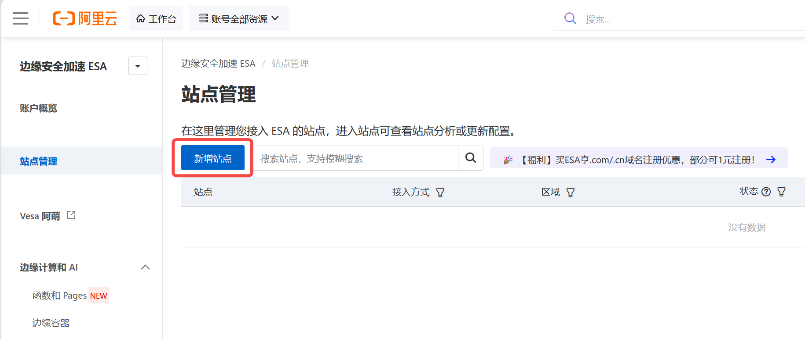
2. 加速区域选择 **中国内地**
   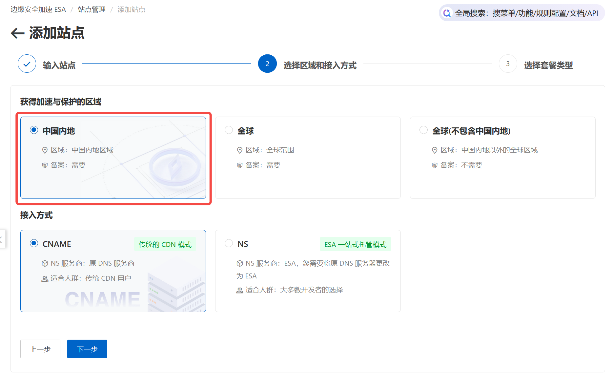
3. 按指示 **添加 TXT 记录** 或 **修改 NS 记录**，完成域名归属权验证
   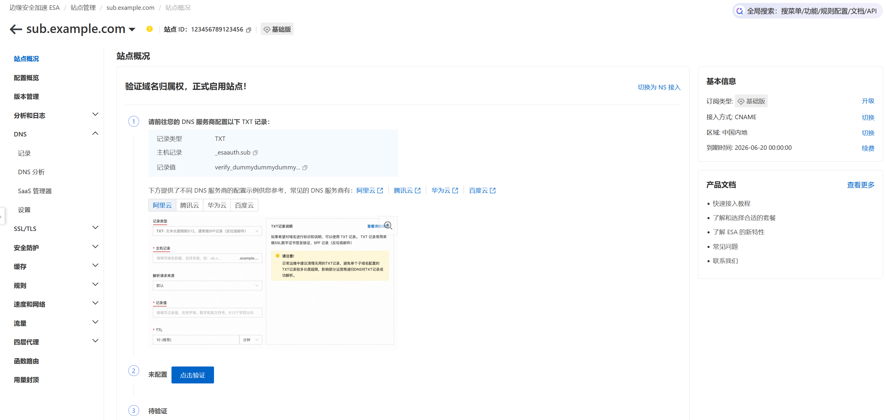

## 2. 添加加速域名

1. 点击 DNS -> 记录 -> 添加记录，输入域名和回源 IP 地址
   - SparkVM 分配给您的 IPv4 和 IPv6 均可使用
   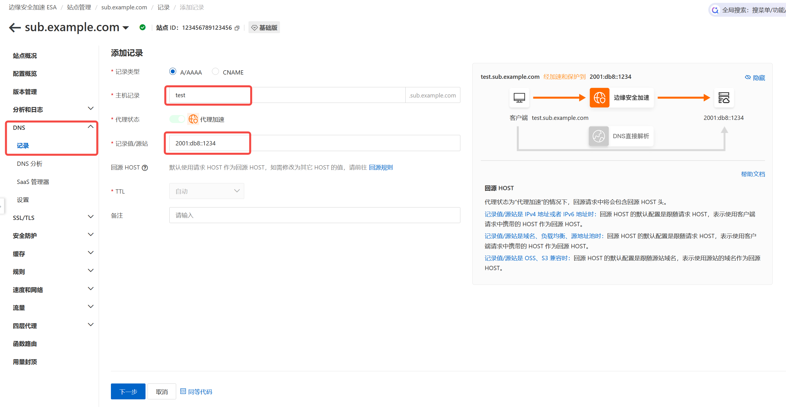
2. 推荐选择 **API 加速** 的规则模板，以获得最佳体验；也可以不使用规则模板，后续自行调整相关配置项
   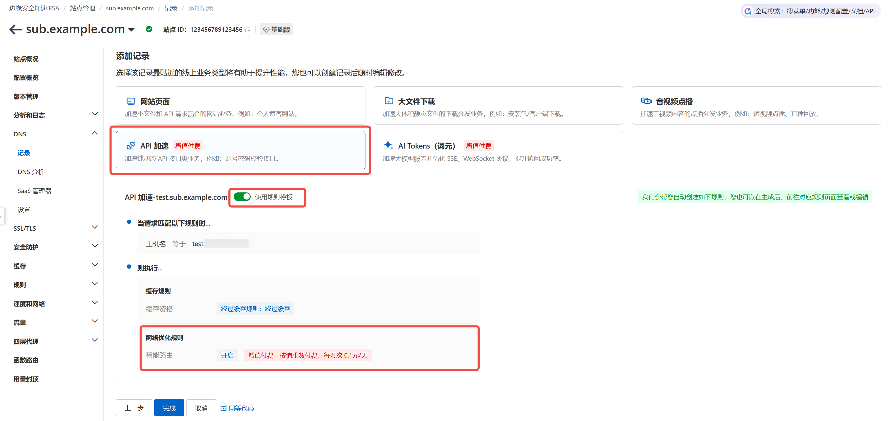
3. 若您使用 **CNAME 模式** 接入，需要在 DNS 服务商处添加对应的 CNAME 记录
4. （推荐）点击 **配置 HTTPS 证书**，确认后 ESA 将自动通过 ACME 申请 TLS 证书并启用
   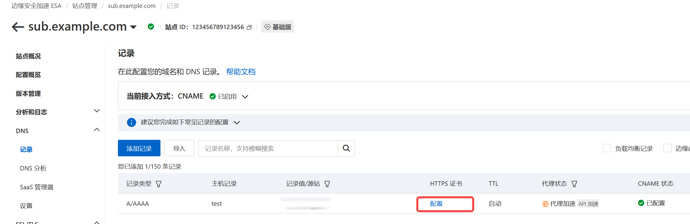
5. （可选）若您的源站监听端口不是 80 / 443，可以通过 **源站证书 -> 回源协议和端口** / **回源规则** 指定回源协议 & 端口
   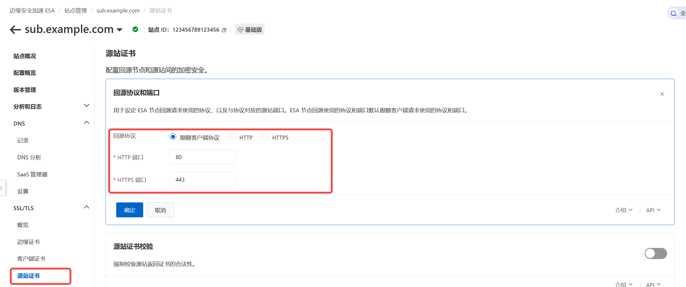

## 3. 优化站点配置

1. 多级缓存：建议使用 **智能缓存层** 或 **区域缓存层**
   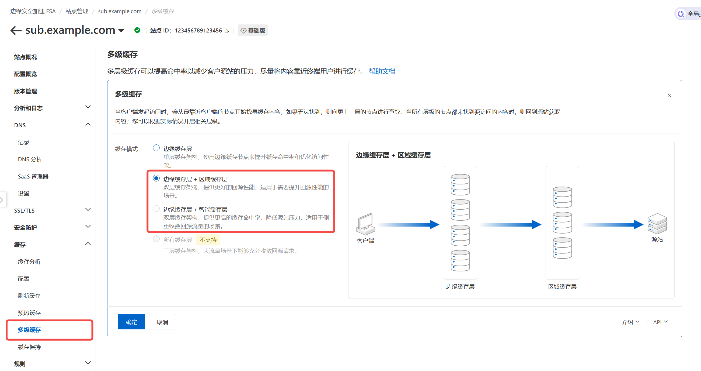
2. 缓存规则：配置 **绕过缓存**
   - 动态请求（如 API）不应被 CDN 缓存，绕过缓存后仍可利用 ESA 的网络加速与安全防护能力
   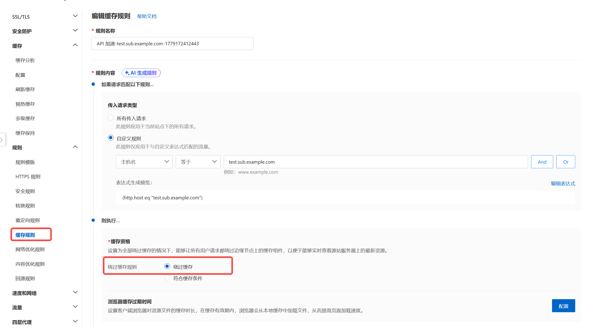
3. （可选）可以按需停用付费的 **智能路由** 加速
   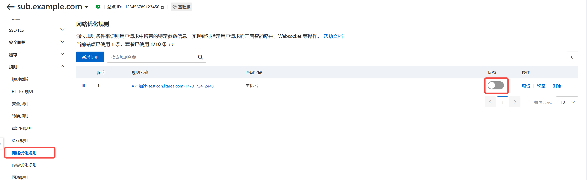
4. （可选）根据您的业务需要，启用 **IPv6 支持** / **WebSocket** / **gRPC**
   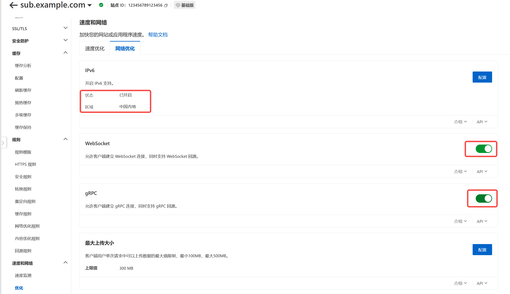
5. （可选）根据您的业务需要，启用 **Gzip** / **Brotli** / **Zstd** / **HTTP/2** / **HTTP/2 回源** / **HTTP/3 (QUIC)**
   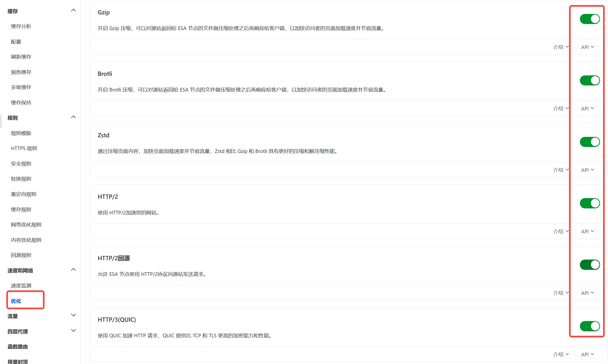

## 4. 验证配置

配置完成后，通过 `curl` 确认 ESA 加速已生效：

```bash
curl -I https://your-domain.com
```

若响应头中出现 `server: ESA`，即表示请求已通过 ESA 节点加速：

```
HTTP/2 200
server: ESA
via: ens-cache17.l2su121-11[9,0,DP], ens-cache22.cn7666[12,0,DP]
x-site-cache-status: DYNAMIC
```

- `server: ESA`：确认流量经过 ESA 网络
- `x-site-cache-status: DYNAMIC`：表示该请求未被缓存，符合绕过缓存的预期配置

您也可以在 [ESA 控制台](https://esa.console.aliyun.com)的流量分析页面中确认是否有流量接入。

## 5. 常见问题

### 访问返回 525 错误

响应头中的 `proxy-status` 会提示具体原因，例如：

```
HTTP/2 525
server: ESA
proxy-status: esa; error=tls_protocol_error; detail=os_error
```

常见原因及解决方法：

- **`tls_protocol_error`——源站未正确监听 HTTPS**：ESA 默认通过 HTTPS 回源，若源站仅监听 HTTP，需在 **源站证书 -> 回源协议和端口** 中将回源协议改为 HTTP
- **回源 IP 或端口配置错误**：检查步骤 2.1 中填写的回源 IP 是否正确，若源站使用非标准端口，确认已按步骤 2.5 配置回源端口

---

如需了解更多 SparkVM 产品信息，请访问 [SparkVM 官网](https://sparkvm.net)；如有疑问或需要帮助，欢迎加入 [Telegram 交流群](https://t.me/sparkvm_chat)。
